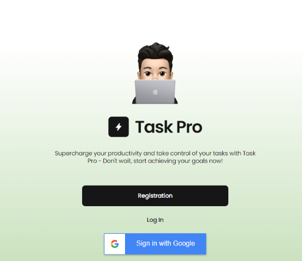
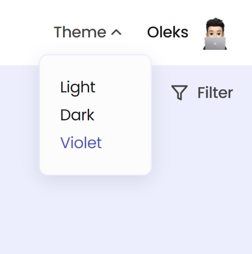
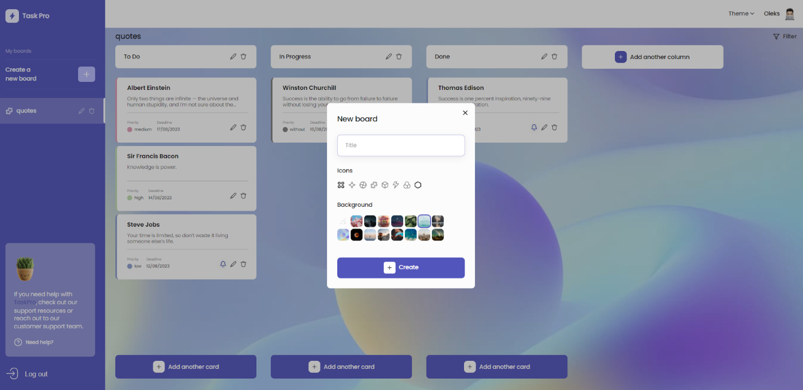
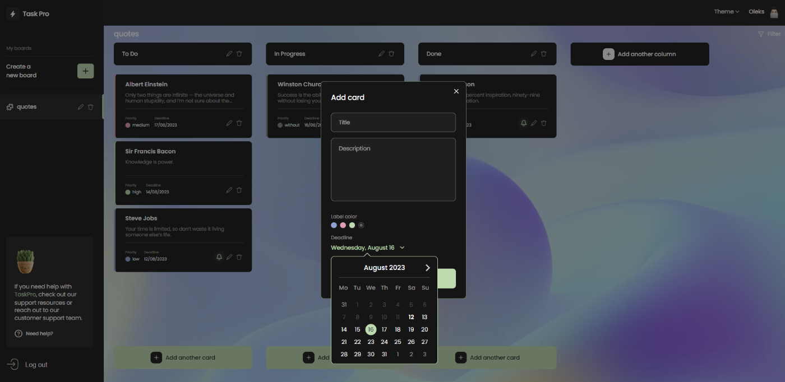
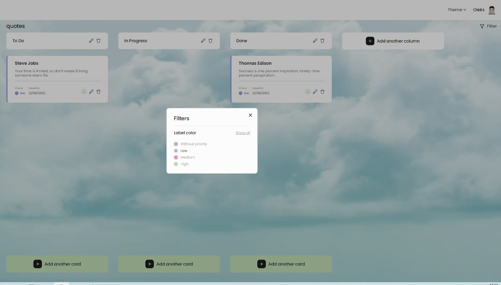
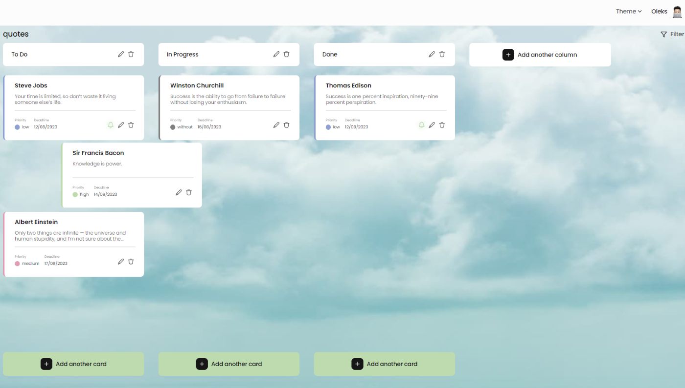
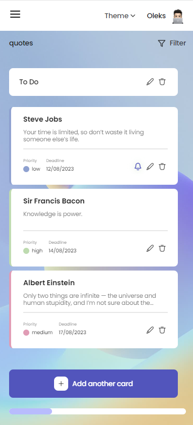

#  TaskPro

**WARNING!** In this project, the backend is deployed on a free cloud service [render.com](https://render.com/), 
so it takes some time for the application to launch for the first time.

### Do you have anything planned?
Use  ***TaskPro*** to increase productivity, prioritize tasks and achieve your goals with efficiency and simply eliminate unnecessary hassle. Do your daily tasks with ***TaskPro*** and enjoy life.
***TaskPro*** is the ultimate to-do list app for work and leisure. The application has a simple and intuitive interface for everyone.

***TaskPro*** prioritizes data security and privacy. The application uses advanced encryption methods and strong authentication mechanisms, protecting your confidential information. You can rest assured that your data remains private and secure on the platform.

To start working with the application, you need to register

By changing the theme using the `Theme`, you can choose the theme of the application according to your mood and change it according to your preferences

***TaskPro*** makes it easy for you to create task boards that you can personalize to suit your style and mood by choosing from a wide range of different themes and backgrounds. Thanks to boards, tasks are organized and work moves. One glance is enough to see all tasks, from planned to completed

Columns allow you to create different stages of tasks according to your needs.
The cards represent the tasks and contain all the information necessary to complete the tasks and determine their priority. They help not to forget about important ideas, effectively plan their tasks and fulfill them on time. A properly created to-do list will set you up for tasks, because you will always have a clear picture of what needs to be done

The user has the ability to filter already loaded cards using the `Filter` interface located on the top panel.

As you complete the tasks, drag the cards between the columns to change their status

Thanks to the adaptive layout, you can access the list of your affairs and organize them at home on a computer, 
even on the go in a mobile application. ***TaskPro*** can be comfortably used on devices with a screen width of 320px. When the screen width is less than 768px, the navigation buttons located on the Sidebar are moved to a modal menu, which is available by clicking on the `Burger Menu` icon. At the same time, for ease of use, the `Filter` and `Theme` remains available on the top panel.

You are welcome to **TaskPro**: [Frontend](https://github.com/torn80beta/project-magic-task-manager.git)

Back-end for **TaskPro**: [Backend](https://github.com/vaaleerkiin/goit-final-project-backend.git)

## The technologies powering front-end:
- SASS

- React

- Redux Toolkit

- React Hooks

- Styled components

- Formik

- Axios

- react-toastify

- react-datepicker

- Node.js

- cloudinary

- mongoose

- swagger-ui-express

- nanoid

- jsonwebtoken

### Thank you for your attention to the project, I hope you enjoy it!

